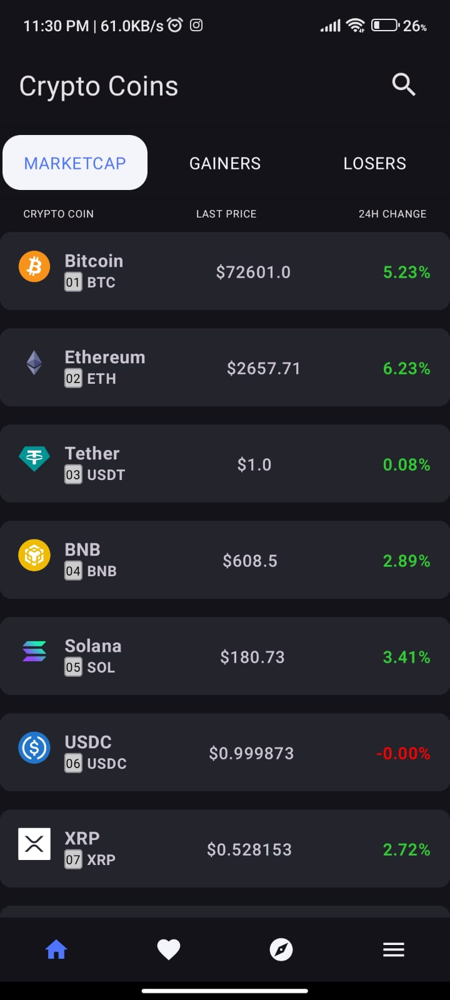
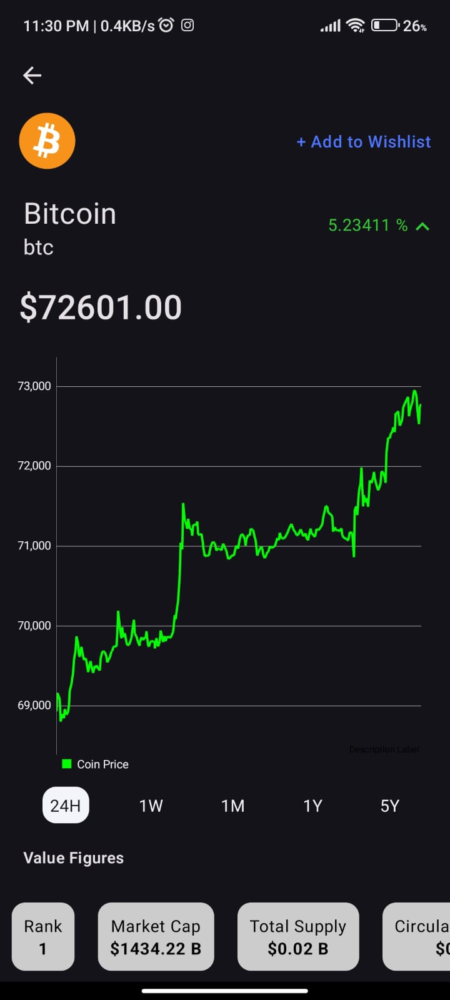

# Crypzee - Cryptocurrency Tracking App 📈💰

Welcome to **Crypzee**—your go-to app for staying updated with real-time cryptocurrency prices, trends, and news! This app is designed to provide fast, no-fluff data and headlines to help you make informed decisions in the crypto world.

## 📱 Screenshots
| Home Screen                             | Coin Details                          | News                         |
|-----------------------------------------|---------------------------------------|------------------------------|
|   |  |  |

*Add screenshots to the `./screenshots/` folder to display them above.*

## ✨ Features

- **Real-Time Market Updates**: Track live prices using the CoinGecko API.
- **Interactive Charts**: Visualize trends easily with MPAndroidChart.
- **Latest Crypto News**: Get top headlines from NewsAPI.
- **User-Friendly Interface**: Intuitive design for effortless tracking.
- **Authentication**: Secure sign-in with Firebase Authentication.
- **Wishlist**: Save your favorite coins with Firestore for easy access.

## 🛠 Tech Stack

### Languages and Frameworks
- **Programming Language**: Kotlin
- **Framework**: Android Studio with Jetpack Compose

### APIs Used
- **CoinGecko API**: Real-time cryptocurrency market data
- **NewsAPI.org**: Fetches the latest cryptocurrency news

### Data Visualization
- **MPAndroidChart**: For interactive charting of cryptocurrency trends

### Architecture
- **MVVM (Model-View-ViewModel)**: Ensures clean, maintainable code

### Storage
- **Firebase Authentication**: For secure user login and management
- **Firestore**: For storing and managing the user's wishlist of coins
- **Local Database**: For caching data and improving performance

### Version Control
- **Git**: For version management and collaboration

## 🚀 Getting Started

1. **Clone the Repository**:  
   ```bash
   git clone https://github.com/your-username/Crypzee.git
## 🚀 Getting Started

2. **Open in Android Studio**:
   - Import the project into Android Studio and sync Gradle files.

3. **Add API Keys**:
   - Obtain your API keys from [CoinGecko](https://www.coingecko.com/en/api) and [NewsAPI](https://newsapi.org/).
   - Add them to your project's `local.properties` file:

     ```properties
     COINGECKO_API_KEY="your_coingecko_key"
     NEWS_API_KEY="your_newsapi_key"
     ```

4. **Firebase Setup**:
   - Set up Firebase in your project by adding the `google-services.json` file in the `app/` directory.
   - Enable Firebase Authentication and Firestore from the Firebase Console.

5. **Run the App**:
   - Build and run on an emulator or a physical device.
